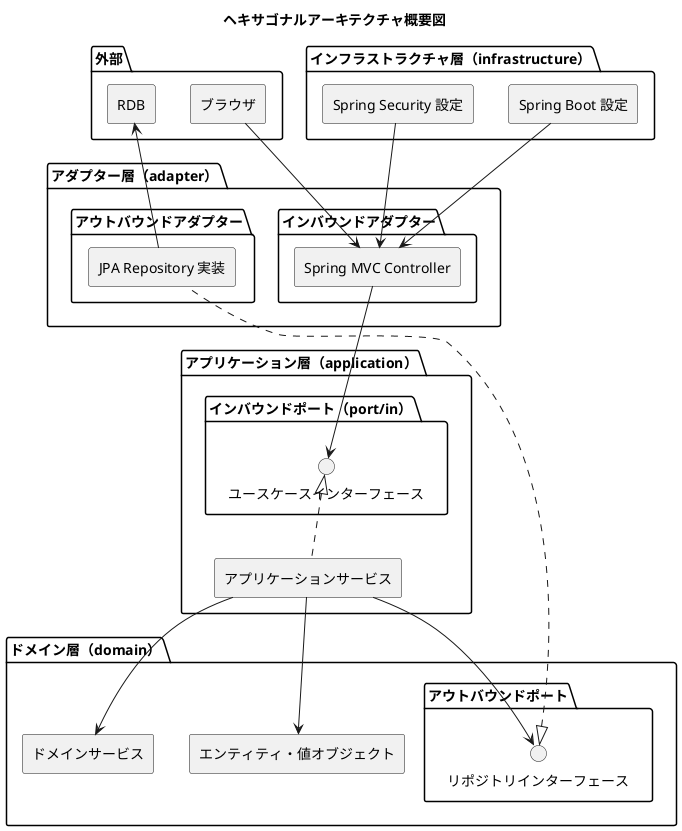
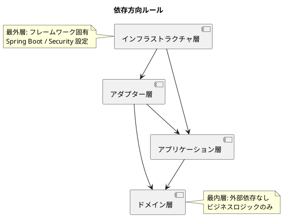

# アーキテクチャ設計 - フレール・メモワール WEB ショップシステム

## 概要

本ドキュメントでは、フレール・メモワール WEB ショップシステムのアーキテクチャ設計を定義する。ヘキサゴナルアーキテクチャ（ポートとアダプター）を採用し、ドメインロジックを外部技術から分離する。

### 技術スタック

- **言語**: Java 25
- **フレームワーク**: Spring Boot
- **テンプレートエンジン**: Thymeleaf（SSR）
- **配置先**: `apps/webapp/` 以下

### アーキテクチャパターン選定理由

要件定義で示されたビジネスドメイン（受注管理・在庫推移・発注管理）は中核の業務領域であり、ビジネスルール（BR01-BR07）の正確な実装が求められる。永続化モデルは単一 RDB であり、CQRS は不要。よって、ドメインモデルパターン + ヘキサゴナルアーキテクチャ（Hexagonal Architecture）を採用する。

## アーキテクチャ概要図



## レイヤー構成

### ドメイン層（最内層）

ビジネスロジックの中核。外部技術への依存を持たない。

- **責務**: エンティティ、値オブジェクト、集約、ドメインサービス、リポジトリインターフェース（アウトバウンドポート）の定義
- **依存方向**: なし（他のどのレイヤーにも依存しない）
- **関連ユースケース**: UC001-UC011 の全ビジネスルール（BR01-BR07）を表現

### アプリケーション層

ユースケースの実行を調整する。ドメイン層のみに依存する。

- **責務**: インバウンドポート（ユースケースインターフェース）の定義、アプリケーションサービスによるユースケース実装、トランザクション境界の管理
- **依存方向**: ドメイン層のみ

### アダプター層

外部とのインターフェースを提供する。アプリケーション層のポートを実装・利用する。

- **責務**: インバウンドアダプター（Spring MVC Controller、Thymeleaf テンプレート連携）、アウトバウンドアダプター（JPA リポジトリ実装）
- **依存方向**: アプリケーション層（インバウンドポート）、ドメイン層（アウトバウンドポートの実装）

### インフラストラクチャ層（最外層）

フレームワーク固有の設定を管理する。

- **責務**: Spring Boot 設定、Spring Security 設定、Bean 定義、プロファイル管理
- **依存方向**: アダプター層、アプリケーション層

## ポート定義

### インバウンドポート（port/in）

外部からドメインへのアクセスを抽象化するインターフェース。

| ポート名 | 責務 | 関連 UC |
|---------|------|---------|
| OrderUseCase | 受注の作成・照会・キャンセル | UC002, UC011 |
| ProductUseCase | 商品マスタの CRUD | UC001 |
| InventoryUseCase | 在庫推移の照会 | UC003 |
| PurchaseOrderUseCase | 発注の作成・管理 | UC004 |
| ArrivalUseCase | 入荷の登録・管理 | UC005 |
| ShipmentUseCase | 出荷処理 | UC006 |
| DeliveryDateUseCase | 届け日の変更 | UC007 |
| DeliveryDestinationUseCase | 届け先コピー | UC008 |
| CustomerUseCase | 得意先管理 | UC009 |
| AuthUseCase | 会員登録・ログイン | UC010 |

### アウトバウンドポート（port/out）

ドメイン層から外部リソースへのアクセスを抽象化するインターフェース。`domain/repository/` に配置する。

| ポート名 | 責務 | 実装先 |
|---------|------|--------|
| OrderRepository | 受注の永続化 | adapter/out/persistence |
| ProductRepository | 商品の永続化 | adapter/out/persistence |
| ItemRepository | 単品の永続化 | adapter/out/persistence |
| StockRepository | 在庫の永続化 | adapter/out/persistence |
| CustomerRepository | 得意先の永続化 | adapter/out/persistence |
| DeliveryDestinationRepository | 届け先の永続化 | adapter/out/persistence |
| SupplierRepository | 仕入先の永続化 | adapter/out/persistence |
| PurchaseOrderRepository | 発注の永続化 | adapter/out/persistence |
| ArrivalRepository | 入荷の永続化 | adapter/out/persistence |

## パッケージ構成

`apps/webapp/` 以下のパッケージ構成を以下に示す。

```plantuml
@startuml
title パッケージ構成図

package "apps/webapp/src/main/java" {

  package "domain" {
    package "domain/model" {
      [エンティティ] as entities
      [値オブジェクト] as value_objects
      [集約] as aggregates
    }
    package "domain/service" {
      [ドメインサービス] as domain_services
    }
    package "domain/repository" {
      [リポジトリインターフェース\n（アウトバウンドポート）] as repo_interfaces
    }
  }

  package "application" {
    package "application/port/in" {
      [ユースケースインターフェース\n（インバウンドポート）] as usecase_interfaces
    }
    package "application/service" {
      [アプリケーションサービス\n（ユースケース実装）] as app_services
    }
  }

  package "adapter" {
    package "adapter/in/web" {
      [Spring MVC Controller] as controllers
      [リクエスト/レスポンス DTO] as dtos
    }
    package "adapter/out/persistence" {
      [JPA リポジトリ実装] as jpa_repos
      [JPA エンティティ] as jpa_entities
    }
  }

  package "infrastructure" {
    package "infrastructure/config" {
      [Spring Boot 設定] as boot_config
    }
    package "infrastructure/security" {
      [Spring Security 設定] as sec_config
    }
  }
}

package "apps/webapp/src/main/resources" {
  package "templates" {
    [Thymeleaf テンプレート] as templates
  }
}

controllers --> usecase_interfaces
app_services ..|> usecase_interfaces
app_services --> entities
app_services --> domain_services
app_services --> repo_interfaces
jpa_repos ..|> repo_interfaces
boot_config --> controllers
sec_config --> controllers

@enduml
```

### パッケージ詳細

| パッケージ | 配置するクラス | レイヤー |
|-----------|--------------|---------|
| `domain/model/` | エンティティ、値オブジェクト、集約ルート | ドメイン層 |
| `domain/service/` | ドメインサービス（在庫推移計算、届け日検証、出荷日判定） | ドメイン層 |
| `domain/repository/` | リポジトリインターフェース（アウトバウンドポート） | ドメイン層 |
| `application/port/in/` | ユースケースインターフェース（インバウンドポート） | アプリケーション層 |
| `application/service/` | アプリケーションサービス（ユースケース実装） | アプリケーション層 |
| `adapter/in/web/` | Spring MVC Controller、DTO | アダプター層 |
| `adapter/out/persistence/` | JPA リポジトリ実装、JPA エンティティ | アダプター層 |
| `infrastructure/config/` | Spring Boot 設定クラス | インフラストラクチャ層 |
| `infrastructure/security/` | Spring Security 設定クラス | インフラストラクチャ層 |

## 依存方向ルール



## トレーサビリティ

| ユースケース | Controller（adapter/in/web） | ユースケースポート（application/port/in） |
|------------|----------------------------|---------------------------------------|
| UC001: 商品マスタ管理 | ProductController | ProductUseCase |
| UC002: WEB 受注 | OrderController | OrderUseCase |
| UC003: 在庫推移 | InventoryController | InventoryUseCase |
| UC004: 発注管理 | PurchaseOrderController | PurchaseOrderUseCase |
| UC005: 入荷管理 | ArrivalController | ArrivalUseCase |
| UC006: 出荷管理 | ShipmentController | ShipmentUseCase |
| UC007: 届け日変更 | OrderController | DeliveryDateUseCase |
| UC008: 届け先コピー | DeliveryDestinationController | DeliveryDestinationUseCase |
| UC009: 得意先管理 | CustomerController | CustomerUseCase |
| UC010: 会員登録・ログイン | AuthController | AuthUseCase |
| UC011: 注文キャンセル | OrderController | OrderUseCase |
