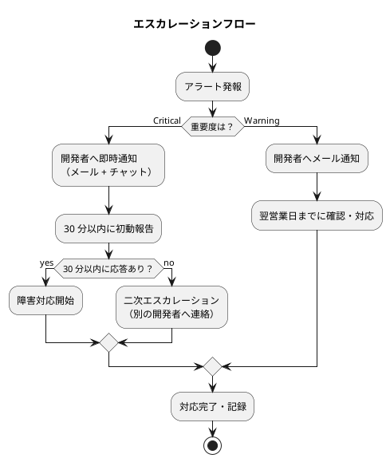
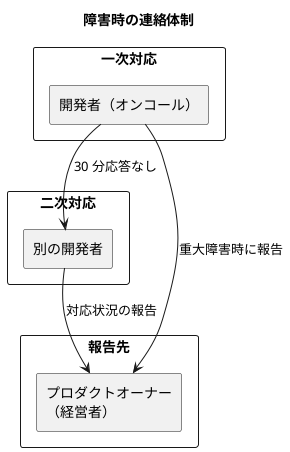

# 運用要件定義 - フレール・メモワール WEB ショップシステム

## 概要

本ドキュメントでは、フレール・メモワール WEB ショップシステムの運用要件を定義する。非機能要件定義（SLA 99.5%、RTO 8 時間、RPO 1 時間）を満たす運用設計を行い、本番稼働後の「運用できない」問題を防ぐ。

### 対象システム

- **システム名**: フレール・メモワール WEB ショップシステム
- **アーキテクチャ**: レイヤード3層アーキテクチャ＋ドメインモデル
- **技術スタック**: Java 25 / Spring Boot / Thymeleaf（SSR）
- **永続化**: 単一 RDB（JPA）
- **初期構成**: 単一サーバー構成

### 運用体制の前提

| 項目 | 内容 | 根拠 |
|------|------|------|
| 運用チーム | 開発者 1〜2 名が運用を兼務 | インセプションデッキ: チーム構成 |
| 運用時間帯 | 営業時間内（9:00-18:00）を基本とし、アラート対応は 24 時間 | 小規模チームで持続可能なペースを維持 |
| 自動化方針 | 手動手順を最小化し、IaC と CI/CD で自動化する | 少人数チームでの運用負荷軽減 |

## 1. 運用フロー設計

### 1.1 日次運用

| タスク | 実施時刻 | 自動化 | 内容 |
|--------|---------|--------|------|
| ヘルスチェック | 毎分 | 自動 | Spring Boot Actuator の `/actuator/health` エンドポイントを監視 |
| ログローテーション | 0:00 | 自動 | Logback の日次ローテーション設定。30 日間保持 |
| DB バックアップ（フル） | 2:00 | 自動 | 日次フルバックアップの実行と完了確認 |
| トランザクションログバックアップ | 毎時 | 自動 | RPO 1 時間を満たすためのログバックアップ |
| アプリケーションログ確認 | 営業開始時 | 手動 | 前日のエラーログ・警告ログの確認 |

### 1.2 月次運用

| タスク | 実施時期 | 自動化 | 内容 |
|--------|---------|--------|------|
| セキュリティパッチ適用 | 月 1 回（計画停止枠） | 半自動 | OS・ミドルウェアのセキュリティパッチを検証環境で確認後に適用 |
| 容量管理レポート | 月末 | 自動 | ディスク使用量・DB サイズ・ログ蓄積量のレポート生成 |
| バックアップリストアテスト | 月 1 回 | 半自動 | 検証環境でリストア手順を実行し、データ整合性を確認 |
| SLA レポート | 月初 | 自動 | 前月の稼働率・レスポンスタイム・エラー率の集計と報告 |
| 監査ログレビュー | 月 1 回 | 手動 | 不正アクセスの兆候・異常な操作パターンの確認 |

### 1.3 年次運用

| タスク | 実施時期 | 内容 |
|--------|---------|------|
| DR テスト | 年 1 回 | 壊滅的障害を想定したフルリストア訓練 |
| セキュリティ監査 | 年 1 回 | 権限設定の棚卸し・不要アカウントの削除 |
| ライセンス更新確認 | 年度末 | 使用ソフトウェアのライセンス有効期限確認 |
| 非機能要件レビュー | 年 1 回 | SLA 目標値の妥当性を実績データに基づいて見直し |

## 2. 監視設計

### 2.1 監視項目

非機能要件定義の監視項目（4.2 節）に基づき、具体的な監視設計を行う。

| カテゴリ | 監視項目 | 収集方法 | 収集間隔 |
|---------|---------|---------|---------|
| インフラ | CPU 使用率 | OS メトリクス | 1 分 |
| インフラ | メモリ使用率（JVM ヒープ） | Spring Boot Actuator `/actuator/metrics` | 1 分 |
| インフラ | ディスク使用率 | OS メトリクス | 5 分 |
| アプリケーション | レスポンスタイム（p50/p95/p99） | Spring Boot Actuator（Micrometer） | 1 分 |
| アプリケーション | HTTP リクエスト数 | Spring Boot Actuator | 1 分 |
| アプリケーション | HTTP 5xx エラー率 | Spring Boot Actuator | 1 分 |
| DB | アクティブコネクション数 | HikariCP メトリクス | 1 分 |
| DB | スロークエリ数 | DB ログ | 5 分 |
| ビジネス | 受注件数 | アプリケーションログ | 1 時間 |

### 2.2 アラート閾値

非機能要件定義の監視項目（4.2 節）で定義された閾値を適用する。

| 監視項目 | Warning | Critical | 備考 |
|---------|---------|----------|------|
| CPU 使用率 | 70%（5 分間平均） | 90%（5 分間平均） | 非機能要件 4.2 準拠 |
| JVM ヒープ使用率 | 70% | 85% | 非機能要件 4.2 準拠 |
| ディスク使用率 | 70% | 85% | 非機能要件 4.2 準拠 |
| p95 レスポンスタイム | 1,500ms | 3,000ms | 非機能要件 4.2 準拠 |
| HTTP 5xx エラー率 | 1%（5 分間平均） | 5%（5 分間平均） | 非機能要件 4.2 準拠 |
| DB コネクション | プールの 70% | プールの 90% | 非機能要件 4.2 準拠 |
| ヘルスチェック失敗 | — | 連続 3 回失敗 | サービス停止の検知 |

### 2.3 エスカレーションフロー

## 3. バックアップ設計

### 3.1 バックアップ方式

RPO 1 時間を満たすため、日次フルバックアップとトランザクションログバックアップを組み合わせる。

| 種別 | 方式 | スケジュール | 保持期間 | 根拠 |
|------|------|------------|---------|------|
| フルバックアップ | DB のフルダンプ | 日次（2:00） | 7 日間 | 1 週間以内の任意の時点へ復旧可能 |
| トランザクションログ | トランザクションログの増分バックアップ | 毎時 | 7 日間 | RPO 1 時間を満たす |
| 設定バックアップ | アプリケーション設定・インフラ設定 | 変更時 | 無期限（Git 管理） | IaC による設定管理 |
| 月次アーカイブ | フルバックアップの長期保存 | 月次（月初） | 1 年間 | 長期復旧・監査対応 |

### 3.2 バックアップ対象

データモデル設計のエンティティに基づき、バックアップ対象を定義する。

| 対象 | 内容 | 重要度 |
|------|------|--------|
| 受注データ | 受注・届け先・メッセージ | 最高（ビジネスクリティカル） |
| 顧客データ | 得意先・届け先情報 | 最高（個人情報） |
| 在庫データ | 在庫・入荷・発注 | 高（業務継続に必要） |
| マスタデータ | 商品・商品構成・単品・仕入先 | 高（業務基盤） |
| 監査ログ | アクセスログ・操作ログ | 中（法令準拠） |
| アプリケーション設定 | Spring Boot 設定、環境変数 | 中（Git 管理で復元可能） |

### 3.3 リストア手順

| 手順 | 内容 | 所要時間目安 |
|------|------|------------|
| 1. 状況確認 | 障害の影響範囲とデータ損失の有無を確認 | 15 分 |
| 2. リストア方針決定 | フルリストア or ポイントインタイムリカバリを選択 | 15 分 |
| 3. バックアップ取得確認 | 最新のフルバックアップとトランザクションログの可用性を確認 | 10 分 |
| 4. DB リストア実行 | フルバックアップからの復元 + トランザクションログの適用 | 60〜120 分 |
| 5. データ整合性確認 | 主要テーブルの件数確認・最新データの存在確認 | 30 分 |
| 6. アプリケーション起動確認 | ヘルスチェック・主要画面の動作確認 | 15 分 |
| 7. サービス復旧宣言 | ステークホルダーへの復旧報告 | — |

## 4. 障害対応設計

### 4.1 障害検知方法

| 検知方法 | 対象 | 精度 |
|---------|------|------|
| ヘルスチェック | サービス全体の生死 | 高（連続 3 回失敗で Critical） |
| レスポンスタイム監視 | 性能劣化 | 高（p95 ベース） |
| エラー率監視 | アプリケーションエラー | 高（5xx エラー率） |
| ログ監視 | アプリケーション異常 | 中（キーワードベース） |
| DB 接続監視 | DB 障害 | 高（コネクション数・応答時間） |

### 4.2 障害パターンと復旧手順

| 障害パターン | 検知方法 | 復旧手順 | 目標復旧時間 |
|------------|---------|---------|------------|
| アプリケーションハング | ヘルスチェック失敗 | 1. プロセス再起動 2. ログ確認 3. 原因調査 | 30 分以内 |
| メモリリーク | JVM ヒープ Critical | 1. ヒープダンプ取得 2. プロセス再起動 3. 原因調査 | 1 時間以内 |
| DB 接続障害 | DB コネクション Critical | 1. DB 接続確認 2. コネクションプール再起動 3. DB 再起動 | 1 時間以内 |
| ディスク容量枯渇 | ディスク使用率 Critical | 1. 不要ログの削除 2. ディスク拡張 | 2 時間以内 |
| データ不整合 | アプリケーションエラーログ | 1. 影響範囲特定 2. データ修復 or バックアップからリストア | 4 時間以内 |
| サーバー障害（全停止） | ヘルスチェック連続失敗 | 1. サーバー復旧 2. アプリケーション起動 3. データ整合性確認 | RTO 8 時間以内 |

### 4.3 連絡体制

| 連絡タイミング | 連絡先 | 内容 |
|-------------|--------|------|
| 障害検知直後 | 開発者（オンコール） | アラート通知（自動） |
| 初動対応開始 | プロダクトオーナー | 障害概要・影響範囲・復旧見込み |
| 復旧完了 | プロダクトオーナー | 復旧報告・原因の暫定説明 |
| 事後分析完了 | 全チーム | ポストモーテムレポート |

## 5. 変更管理設計

### 5.1 リリース手順

CI/CD パイプラインによる自動化を前提とし、手動手順を最小化する。

| 手順 | 内容 | 自動化 |
|------|------|--------|
| 1. コードレビュー | Pull Request のレビュー・承認 | 手動 |
| 2. 自動テスト | ユニットテスト・統合テスト・品質ゲート | 自動（CI） |
| 3. ステージング環境デプロイ | ステージング環境への自動デプロイ | 自動（CD） |
| 4. ステージング検証 | 主要機能の動作確認 | 半自動（E2E テスト + 目視確認） |
| 5. 本番デプロイ承認 | デプロイ実行の承認 | 手動 |
| 6. 本番デプロイ | 本番環境への自動デプロイ | 自動（CD） |
| 7. 本番検証 | ヘルスチェック・主要機能の動作確認 | 半自動 |

### 5.2 ロールバック手順

| 手順 | 内容 | 所要時間目安 |
|------|------|------------|
| 1. 問題判定 | デプロイ後の異常を検知・判定 | 15 分以内 |
| 2. ロールバック決定 | ロールバック実施を決定（開発者判断） | 5 分以内 |
| 3. 前バージョンへの切り替え | 前バージョンのアプリケーションをデプロイ | 10 分以内 |
| 4. DB マイグレーションの巻き戻し | 必要に応じて DB 変更の巻き戻し | 15 分以内 |
| 5. 動作確認 | ヘルスチェック・主要機能の確認 | 10 分以内 |
| 6. 報告 | ロールバック完了の報告 | — |

### 5.3 変更承認フロー

| 変更種別 | 影響範囲 | 承認者 | リードタイム |
|---------|---------|--------|------------|
| 通常リリース | 新機能・改善 | 開発者間のコードレビュー | 1 営業日 |
| 緊急パッチ | セキュリティ脆弱性・重大バグ | 開発者 1 名の承認 | 即時 |
| インフラ変更 | サーバー設定・DB 設定 | 開発者間のレビュー | 1 営業日 |
| マスタデータ変更 | 商品・単品・仕入先 | プロダクトオーナーの承認 | 即時〜1 営業日 |

## 非機能要件との整合性

| 非機能要件 | 運用要件での対応 |
|-----------|---------------|
| SLA 99.5% | ヘルスチェック監視（毎分）、障害対応手順の事前整備 |
| RTO 8 時間（重大障害） | 障害パターン別の復旧手順、連絡体制の定義 |
| RPO 1 時間 | 毎時トランザクションログバックアップ、月次リストアテスト |
| レスポンスタイム p95 Warning: 1,500ms / Critical: 3,000ms | レスポンスタイム監視（1 分間隔）、閾値アラート |
| エラー率 < 1% | HTTP 5xx エラー率監視（5 分間平均）、閾値アラート |
| 監査ログ 1 年保持 | 月次アーカイブバックアップ（1 年保持）、月次監査ログレビュー |
