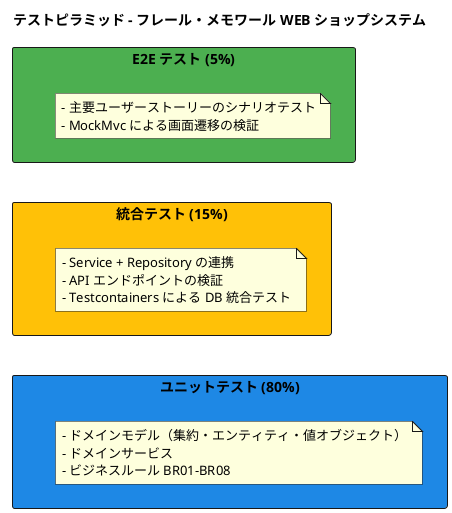
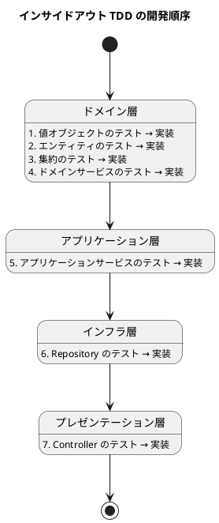

# テスト戦略 - フレール・メモワール WEB ショップシステム

## 概要

本ドキュメントでは、フレール・メモワール WEB ショップシステムのテスト戦略を定義する。レイヤード3層アーキテクチャ＋ドメインモデルパターンに基づき、ピラミッド形テストを採用する。変更を楽に安全にできて役に立つソフトウェアを実現するため、TDD を中心としたテスト駆動の開発プロセスを推進する。

### 対象システム

- **システム名**: フレール・メモワール WEB ショップシステム
- **アーキテクチャ**: レイヤード3層アーキテクチャ＋ドメインモデル
- **技術スタック**: Java 25 / Spring Boot / Thymeleaf（SSR）
- **永続化**: 単一 RDB（JPA）

## テストピラミッド設計

### テスト形態の選定

本システムはドメインモデルパターンを採用しており、ビジネスルール（BR01-BR08）がドメイン層に集約されている。このため、ピラミッド形テストを選定する。

### テスト比率

| テスト種別 | 比率 | 主な対象 |
|-----------|------|---------|
| ユニットテスト | 80% | ドメインモデル、値オブジェクト、ドメインサービス |
| 統合テスト | 15% | Service-Repository 連携、API エンドポイント |
| E2E テスト | 5% | 主要ユーザーストーリーの画面遷移シナリオ |

### バックエンド層別テスト方針

#### ドメイン層

ドメイン層はビジネスロジックの中核であり、ユニットテストの最重要対象である。外部依存を持たないため、純粋なユニットテストで高速に検証できる。

- **テスト対象**: エンティティ、値オブジェクト、集約、ドメインサービス
- **テスト方針**: 全ビジネスルール（BR01-BR08）を網羅するユニットテスト
- **テストツール**: JUnit 5 + AssertJ

#### アプリケーション層

アプリケーション層はユースケースの調整を担う。ドメインサービスとの連携をモックで検証し、トランザクション境界の正しさを統合テストで確認する。

- **テスト対象**: アプリケーションサービス
- **テスト方針**: ユースケースのフロー検証、トランザクション境界の確認
- **テストツール**: JUnit 5 + Mockito + Spring Boot Test

#### インフラ層

インフラ層は永続化やフレームワーク固有の設定を担う。Testcontainers を利用した統合テストで、実際のデータベースとの連携を検証する。

- **テスト対象**: JPA Repository 実装、Spring Security 設定
- **テスト方針**: 実 DB を使用した統合テスト、セキュリティ設定の検証
- **テストツール**: Spring Boot Test + Testcontainers

### フロントエンド（Thymeleaf SSR）テスト方針

本システムは Thymeleaf による SSR（サーバーサイドレンダリング）を採用しているため、フロントエンドテストは MockMvc を中心に行う。SPA 向けのフロントエンドテストツールは使用しない。

- **テスト対象**: Controller + Thymeleaf テンプレート
- **テスト方針**: MockMvc による HTTP リクエスト/レスポンスの検証、画面遷移の確認、フォームバリデーションの検証
- **テストツール**: Spring MockMvc + HtmlUnit（必要に応じて）

## テスト種別の定義

### ユニットテスト

ドメインモデルのビジネスロジックを検証する最も重要なテスト種別である。

| 項目 | 内容 |
|------|------|
| フレームワーク | JUnit 5 |
| アサーション | AssertJ |
| モック | Mockito（アプリケーション層のテストで使用） |
| 対象 | 値オブジェクト、エンティティ、集約、ドメインサービス |

#### テスト対象と方針

| 対象 | テスト方針 | 関連ビジネスルール |
|------|-----------|-----------------|
| 受注集約 | ステータス遷移、不変条件の検証 | BR01, BR02 |
| 受注ステータス（値オブジェクト） | 遷移パターンの網羅 | - |
| 届け日（値オブジェクト） | 有効範囲の検証 | BR07 |
| 商品集約 | 構成設定、廃止処理 | - |
| 価格（値オブジェクト） | 金額の妥当性検証 | - |
| 在庫集約 | 使用・廃棄のステータス遷移 | BR05 |
| 品質維持日数（値オブジェクト） | 期限日計算 | BR05 |
| 得意先集約 | メールアドレス・パスワードの検証 | - |
| 届け先集約 | コピー機能の正確性 | - |
| 単品集約 | 品質維持日数の管理 | BR04, BR05 |
| 仕入先集約 | 基本的な CRUD | BR04 |
| 発注集約 | ステータス遷移（発注済み → 入荷済み） | BR03 |
| 入荷集約 | 入荷数量の妥当性 | - |
| 在庫推移計算サービス（ドメインサービス） | 日別有効在庫の計算ロジック | BR06 |
| 届け日検証サービス（ドメインサービス） | 有効範囲の判定 | BR07 |
| 出荷日判定サービス（ドメインサービス） | 出荷日の算出 | BR02 |

#### ビジネスルール別テスト観点

| ビジネスルール | テスト観点 |
|--------------|-----------|
| BR01: 1受注 = 1届け先 = 1商品 | 受注作成時の不変条件検証 |
| BR02: 出荷日 = 届け日 - 1日 | 出荷日判定サービスのテスト |
| BR03: 発注判断は人間が行う | 発注ステータス遷移のテスト |
| BR04: 単品ごとに特定の仕入先 | 単品と仕入先の関連検証 |
| BR05: 品質維持日数を考慮した在庫管理 | 品質期限日の算出テスト |
| BR06: 在庫推移計算 | 在庫推移計算サービスの網羅的テスト |
| BR07: 届け日の有効範囲 | 届け日検証サービスの境界値テスト |
| BR08: キャンセル期限 | 受注キャンセル処理の期限検証 |

### 統合テスト

アプリケーション層とインフラ層の連携を検証する。

| 項目 | 内容 |
|------|------|
| フレームワーク | Spring Boot Test |
| DB テスト | Testcontainers（PostgreSQL） |
| 対象 | Service + Repository 連携、API エンドポイント |

#### テスト対象と方針

| 対象 | テスト方針 |
|------|-----------|
| OrderService + OrderRepository | 受注の永続化と取得、ステータス更新 |
| ProductService + ProductRepository | 商品マスタの CRUD、構成管理 |
| InventoryService + StockRepository | 在庫推移の計算と永続化 |
| CustomerService + CustomerRepository | 得意先の CRUD、認証情報管理 |
| PurchaseOrderService + PurchaseOrderRepository | 発注の永続化とステータス管理 |
| ArrivalService + ArrivalRepository | 入荷記録の永続化 |
| AuthService | ログイン・会員登録の認証フロー |

### E2E テスト

主要ユーザーストーリーの画面遷移とフローを検証する。Thymeleaf SSR 構成のため、MockMvc を使用した E2E テストを行う。

| 項目 | 内容 |
|------|------|
| フレームワーク | Spring MockMvc + Spring Boot Test |
| 対象 | 主要ユーザーストーリーの画面遷移シナリオ |

#### E2E テスト対象ユーザーストーリー

| ユーザーストーリー | シナリオ |
|-----------------|---------|
| US005: WEB ショップからの注文（UC002） | 商品選択 → 届け日指定 → 届け先入力 → 注文確定の一連フロー |
| US007: 在庫推移確認（UC003） | 在庫推移画面の表示と計算結果の検証 |
| US009: 入荷登録（UC005） | 入荷登録 → 在庫反映の一連フロー |
| US014: ログイン（UC010） | ログイン画面 → 認証 → ダッシュボードの遷移 |
| US015: 注文キャンセル（UC011） | 注文一覧 → キャンセル申請 → キャンセル確定の遷移 |

### 性能テスト

主要 API エンドポイントのレスポンスタイムを計測し、性能要件を満たすことを確認する。

- **対象**: 受注登録 API、在庫推移取得 API
- **基準**: 95 パーセンタイルで 500ms 以内
- **ツール**: JMeter または Gatling（CI/CD パイプラインでの定期実行）

### セキュリティテスト

Spring Security の設定と認証・認可の動作を検証する。

- **対象**: 認証（ログイン/ログアウト）、認可（ロールベースアクセス制御）、入力値のサニタイズ
- **方針**: MockMvc による認証フローのテスト、未認証アクセスの拒否検証
- **ツール**: Spring Security Test

## カバレッジ目標

### 全体目標

| 対象 | カバレッジ目標 |
|------|--------------|
| 全体 | 80% 以上 |

### 層別目標

| 層 | カバレッジ目標 | 根拠 |
|----|--------------|------|
| ドメイン層 | 90% 以上 | ビジネスロジックの正確性が最重要 |
| アプリケーション層 | 85% 以上 | ユースケースのフロー網羅 |
| インフラ層 | 70% 以上 | フレームワーク依存部分は統合テストで補完 |
| プレゼンテーション層 | 70% 以上 | Controller のリクエスト/レスポンス検証 |

## テスト環境・データ戦略

### テストデータ管理方針

テストデータの作成には Object Mother パターンを採用し、テスト間の独立性を確保する。

| パターン | 用途 |
|---------|------|
| Object Mother | ドメインオブジェクトのテストデータ生成 |
| Test Data Builder | 複雑なオブジェクトグラフの構築 |

#### テストデータパターンの使い分け

- **ユニットテスト**: Object Mother でシンプルなテストデータを生成
- **統合テスト**: Test Data Builder で DB に投入するデータを構築
- **E2E テスト**: テストシナリオ固有のデータセットを事前準備

### モック・スタブの利用方針

| 層 | モック方針 |
|----|-----------|
| ドメイン層 | モック不使用（純粋なユニットテスト） |
| アプリケーション層 | Mockito で Repository をモック |
| プレゼンテーション層 | MockMvc で HTTP リクエストをシミュレート |
| インフラ層 | Testcontainers で実 DB を使用（モック不使用） |

### テスト環境の構成

| 環境 | 構成 |
|------|------|
| ローカル開発 | H2 インメモリ DB + Spring Boot DevTools |
| CI | Testcontainers（PostgreSQL）+ GitHub Actions |
| ステージング | 本番同等の DB 構成 |

### テスト分離

- `@Transactional` アノテーションによるテストごとの自動 Rollback
- Testcontainers によるテスト実行ごとの DB コンテナ初期化
- テスト間の状態共有を禁止し、各テストが独立して実行可能

## CI/CD との統合方針

### テスト実行タイミング

| タイミング | 実行テスト | 目的 |
|-----------|-----------|------|
| コミット時 | ユニットテスト | 高速なフィードバック（数秒） |
| PR（プルリクエスト）時 | ユニットテスト + 統合テスト | マージ前の品質確認 |
| デプロイ前 | 全テスト（ユニット + 統合 + E2E） | リリース品質の保証 |

### Quality Gate の基準

| 基準 | 閾値 |
|------|------|
| テスト成功率 | 100%（全テストパス） |
| カバレッジ（全体） | 80% 以上 |
| カバレッジ（ドメイン層） | 90% 以上 |
| 重複コード | 3% 以下 |
| セキュリティ脆弱性 | Critical / High: 0 件 |

品質ゲートを通過しない場合、マージおよびデプロイをブロックする。

## TDD/BDD 方針

### バックエンド: インサイドアウト TDD

バックエンドはインサイドアウト TDD を採用する。ドメイン層から外側のレイヤーへ向かって開発を進める。

#### TDD サイクル

1. **Red**: 失敗するテストを書く
2. **Green**: テストを通す最小限の実装を書く
3. **Refactor**: 重複を除去し設計を改善する

### フロントエンド: アウトサイドイン TDD

フロントエンド（Thymeleaf SSR）はアウトサイドイン TDD を採用する。ユーザーの操作シナリオから内部の実装へ向かって開発を進める。

1. MockMvc で画面遷移のテストを書く（Red）
2. Controller と Thymeleaf テンプレートを実装する（Green）
3. リファクタリングする（Refactor）

## トレーサビリティ

### ユースケース × テスト種別 対応表

| ユースケース | ユニットテスト | 統合テスト | E2E テスト |
|-------------|--------------|-----------|-----------|
| UC001: 商品マスタ管理 | 商品集約、単品集約、値オブジェクト | ProductService + Repository | - |
| UC002: WEB 受注 | 受注集約、届け日検証サービス、出荷日判定サービス | OrderService + Repository | US005 |
| UC003: 在庫推移 | 在庫推移計算サービス、在庫集約 | InventoryService + Repository | US007 |
| UC004: 発注管理 | 発注集約、発注ステータス | PurchaseOrderService + Repository | - |
| UC005: 入荷管理 | 入荷集約、入荷数量 | ArrivalService + Repository | US009 |
| UC006: 出荷管理 | 出荷日判定サービス | ShipmentService | - |
| UC007: 届け日変更 | 届け日検証サービス、受注集約 | DeliveryDateService | - |
| UC008: 届け先コピー | 届け先集約 | DeliveryDestinationService | - |
| UC009: 得意先管理 | 得意先集約、値オブジェクト | CustomerService + Repository | - |
| UC010: 会員登録・ログイン | 得意先集約（認証関連） | AuthService | US014 |
| UC011: 注文キャンセル | 受注集約（キャンセル処理） | OrderService | US015 |

## ドメイン固有のテスト対象

### 在庫推移計算（BR06）

在庫推移計算は本システムの中核的なビジネスロジックである。以下の観点でユニットテストを実施する。

- 日別有効在庫の計算: `現在庫 + 入荷予定 - 受注引当 - 廃棄予定`
- 入荷日を Day 0 起算、日単位カウントの正確性
- 境界値（在庫 0、入荷予定なし、全量引当済み）

### 届け日バリデーション（BR07）

届け日の有効範囲検証は受注フローの重要な制約である。

- 最短届け日: 注文日 + 3日
- 最長届け日: 注文日 + 30日
- 注文受付期限: 届け日の 3日前
- 境界値テスト（ちょうど 3日前、ちょうど 30日後）

### 受注ステータス遷移

受注ステータスの遷移は以下のパターンを網羅的にテストする。

- 受注済み → 届け日変更済み
- 受注済み → 出荷準備中 → 出荷済み → 配送完了
- 受注済み → キャンセル（BR08: 届け日の 3日前まで）
- 不正な遷移の拒否（例: 出荷済み → 受注済み）

### 9 集約のテスト対象

| 集約 | 主要テスト観点 |
|------|--------------|
| 受注 | ステータス遷移、不変条件（BR01）、届け日変更、キャンセル（BR08） |
| 得意先 | メールアドレス形式、パスワードハッシュ化 |
| 届け先 | コピー機能、必須フィールド検証 |
| 商品 | 構成設定、廃止処理、価格の妥当性 |
| 単品 | 品質維持日数の管理（BR05）、仕入先の紐づけ（BR04） |
| 仕入先 | 基本 CRUD、単品との関連 |
| 発注 | ステータス遷移（発注済み → 入荷済み）、発注数量 |
| 入荷 | 入荷数量、発注との関連 |
| 在庫 | ステータス遷移（入荷済み → 使用済み / 廃棄）、品質期限日 |

### ドメインサービスのテスト対象

| ドメインサービス | テスト観点 | 関連 BR |
|----------------|-----------|--------|
| 在庫推移計算サービス | 日別有効在庫の正確な計算、境界値 | BR06 |
| 届け日検証サービス | 有効範囲の判定、境界値 | BR07 |
| 出荷日判定サービス | 出荷日の算出ロジック | BR02 |
