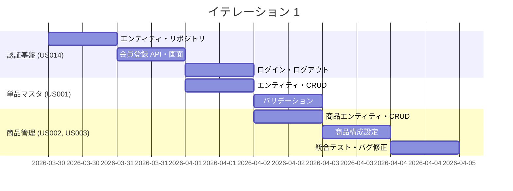

# イテレーション 1 計画

## 概要

| 項目 | 内容 |
|------|------|
| **イテレーション** | 1 |
| **期間** | 2026-03-30 〜 2026-04-05（1 週間） |
| **ゴール** | 認証基盤と商品管理の基盤を構築し、スタッフが単品・商品を登録できる状態にする |
| **目標 SP** | 10 |

---

## ゴール

### イテレーション終了時の達成状態

1. **認証基盤**: 得意先が会員登録・ログインできる
2. **単品マスタ**: スタッフが単品（花）を登録・一覧表示できる
3. **商品管理**: スタッフが商品（花束）を登録し、構成（単品の組合せ）を設定できる

### 成功基準

- [ ] 会員登録フォームからユーザーを登録できる
- [ ] ログイン・ログアウトが正常に動作する
- [ ] 単品マスタの CRUD 操作が完了している
- [ ] 商品（花束）の登録と構成設定が動作する
- [ ] テストカバレッジ 80% 以上

---

## ユーザーストーリー

### 対象ストーリー

| ID | ユーザーストーリー | SP | 優先度 |
|----|-------------------|----|----|
| US014 | 会員登録・ログイン | 3 | 必須 |
| US001 | 単品マスタ登録 | 2 | 必須 |
| US002 | 商品（花束）登録 | 2 | 必須 |
| US003 | 商品構成設定 | 3 | 必須 |
| **合計** | | **10** | |

### ストーリー詳細

#### US014: 会員登録・ログイン

**ストーリー**:
> 得意先として、WEB ショップに会員登録してログインしたい。なぜなら、注文や届け先コピーなどの機能を利用するために本人確認が必要だからだ。

**受入条件**:

1. メールアドレス・パスワード・名前・連絡先で会員登録できる
2. 登録済みのメールアドレスとパスワードでログインできる
3. 重複メールアドレスで登録しようとするとエラーが表示される
4. 誤ったパスワードでログインするとエラーが表示される

#### US001: 単品マスタ登録

**ストーリー**:
> フレール・メモワール スタッフとして、単品（花）のマスタを登録したい。なぜなら、商品（花束）の構成に使用する花材を整備する必要があるからだ。

**受入条件**:

1. 単品名・品質維持日数・仕入先を入力して保存できる
2. 単品名が空欄の場合はエラーが表示される
3. 品質維持日数が 0 日以下の場合はエラーが表示される

#### US002: 商品（花束）登録

**ストーリー**:
> フレール・メモワール スタッフとして、商品（花束）を新規登録したい。なぜなら、得意先に提供する商品ラインナップを拡充する必要があるからだ。

**受入条件**:

1. 商品名・説明・価格を入力して保存できる
2. 価格が 0 円以下の場合はエラーが表示される
3. 価格 1 円以上で正しく登録される

#### US003: 商品構成設定

**ストーリー**:
> フレール・メモワール スタッフとして、商品（花束）の構成（単品の組合せ）を設定したい。なぜなら、花束に使用する花材の種類と数量を定義する必要があるからだ。

**受入条件**:

1. 商品に対して単品と数量の組合せを設定できる
2. 構成が空（単品 0 件）の場合はエラーが表示される
3. 単品数量 1 本以上で正しく保存される

### タスク

#### 1. 認証基盤（US014: 3 SP）

| # | タスク | 見積もり | 担当 | 状態 |
|---|--------|---------|------|------|
| 1.1 | ユーザーエンティティ・リポジトリの設計と実装 | 4h | - | [ ] |
| 1.2 | 会員登録 API・画面の実装 | 4h | - | [ ] |
| 1.3 | ログイン・ログアウト機能の実装（Spring Security） | 4h | - | [ ] |
| 1.4 | バリデーション（重複メール、パスワード不正）の実装 | 2h | - | [ ] |

**小計**: 14h（理想時間）

#### 2. 単品マスタ登録（US001: 2 SP）

| # | タスク | 見積もり | 担当 | 状態 |
|---|--------|---------|------|------|
| 2.1 | 単品エンティティ・リポジトリの設計と実装 | 4h | - | [ ] |
| 2.2 | 単品 CRUD API・画面の実装 | 4h | - | [ ] |
| 2.3 | バリデーション（単品名必須、品質維持日数 >= 1）の実装 | 2h | - | [ ] |

**小計**: 10h（理想時間）

#### 3. 商品登録（US002: 2 SP）

| # | タスク | 見積もり | 担当 | 状態 |
|---|--------|---------|------|------|
| 3.1 | 商品エンティティ・リポジトリの設計と実装 | 4h | - | [ ] |
| 3.2 | 商品 CRUD API・画面の実装 | 4h | - | [ ] |
| 3.3 | バリデーション（価格 >= 1）の実装 | 2h | - | [ ] |

**小計**: 10h（理想時間）

#### 4. 商品構成設定（US003: 3 SP）

| # | タスク | 見積もり | 担当 | 状態 |
|---|--------|---------|------|------|
| 4.1 | 商品構成エンティティ・リポジトリの設計と実装 | 4h | - | [ ] |
| 4.2 | 商品構成設定 API・画面の実装 | 4h | - | [ ] |
| 4.3 | バリデーション（構成 >= 1 件、数量 >= 1）の実装 | 2h | - | [ ] |
| 4.4 | 商品詳細画面での構成表示 | 2h | - | [ ] |

**小計**: 12h（理想時間）

#### タスク合計

| カテゴリ | SP | 理想時間 | 状態 |
|---------|----|----|------|
| 認証基盤（US014） | 3 | 14h | [ ] |
| 単品マスタ登録（US001） | 2 | 10h | [ ] |
| 商品登録（US002） | 2 | 10h | [ ] |
| 商品構成設定（US003） | 3 | 12h | [ ] |
| **合計** | **10** | **46h** | |

**1 SP あたり**: 約 4.6h
**進捗率**: 0% (0/10 SP)

---

## スケジュール

### Week 1（Day 1-5: 2026-03-30 〜 2026-04-03）

| 日 | タスク |
|----|--------|
| Day 1 (3/30) | 認証: エンティティ・リポジトリの設計と実装 |
| Day 2 (3/31) | 認証: 会員登録 API・画面の実装 |
| Day 3 (4/1) | 認証: ログイン・ログアウト、単品: エンティティ・CRUD |
| Day 4 (4/2) | 単品: バリデーション、商品: エンティティ・CRUD |
| Day 5 (4/3) | 商品構成設定、統合テスト・バグ修正 |

---

## リスクと対策

| リスク | 影響度 | 対策 |
|--------|--------|------|
| Spring Security の設定が複雑 | 中 | ADR-001 に従い標準的な設定を使用、公式ドキュメント参照 |
| 商品構成のデータモデルが複雑 | 中 | 多対多リレーションをシンプルに設計、TDD で段階的に実装 |
| テストカバレッジ目標未達 | 低 | TDD サイクルを厳守し、テストファーストで開発 |

---

## 完了条件

### Definition of Done

- [ ] コードレビュー完了
- [ ] ユニットテストがパス
- [ ] E2E テストがパス
- [ ] ESLint エラーなし
- [ ] 機能がローカル環境で動作確認済み
- [ ] ドキュメント更新完了

### デモ項目

1. 会員登録フォームからの新規ユーザー登録
2. ログイン・ログアウトの動作確認
3. 単品マスタの登録・一覧表示
4. 商品（花束）の登録と構成設定

---

## 更新履歴

| 日付 | 更新内容 | 更新者 |
|------|---------|--------|
| 2026-03-30 | 初版作成 | - |

---

## 関連ドキュメント

- [リリース計画](./release_plan.md)
