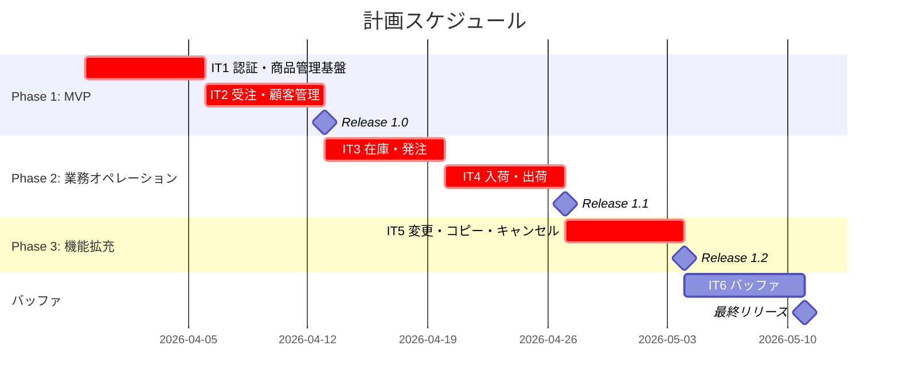
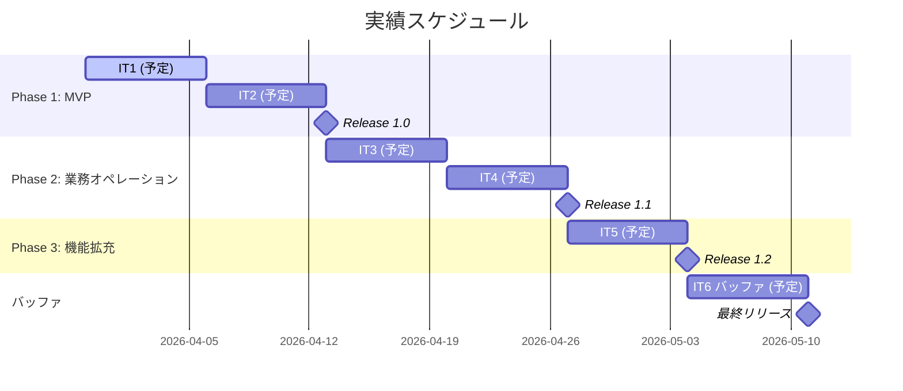
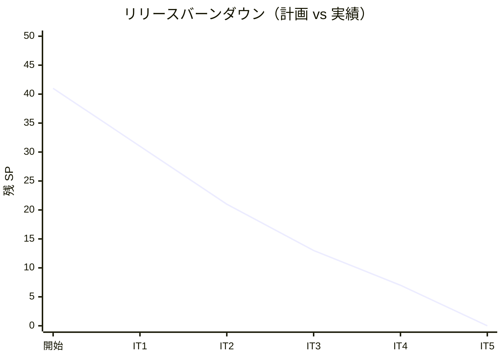

# リリース計画 - フレール・メモワール WEB ショップシステム

## 概要

本ドキュメントは、フレール・メモワール WEB ショップシステムのリリース計画を定義します。

### プロジェクト情報

| 項目 | 内容 |
|------|------|
| **プロジェクト名** | フレール・メモワール WEB ショップシステム |
| **目的** | 受注から出荷までの業務を効率化し、在庫推移の可視化により廃棄ロスを最小化する。リピーターが簡単に注文できる仕組みを提供する。 |
| **対象ユーザー** | 得意先（花束購入者）、フレール・メモワール スタッフ |
| **開発チーム** | 1 名 |

---

## 満足条件

### スコープ

3 フェーズに分けてリリースする。MVP で基本的な商品管理と受注機能を提供し、段階的に業務オペレーションと利便性向上機能を追加する。

| フェーズ | 内容 | ストーリー数 |
|---------|------|-------------|
| Phase 1 | MVP: 認証・商品管理・基本受注 | 8 US |
| Phase 2 | 業務オペレーション: 在庫・発注・入荷・出荷 | 4 US |
| Phase 3 | 機能拡充: 届け日変更・届け先コピー・キャンセル | 3 US |
| **合計** | | **15 US** |

### スケジュール

- **開発期間**: 5 週間 + バッファ 1 週間 = 6 週間
- **イテレーション**: 1 週間 x 5 イテレーション + バッファ 1 イテレーション
- **リリース**: Phase ごとの段階的リリース

### リソース

- **開発者**: 1 名
- **想定稼働時間**: 40 時間/週

---

## ユーザーストーリー一覧とストーリーポイント

### 優先順位マトリックス

4 軸評価で優先順位を決定:

1. **金銭価値（BV）**: ビジネス価値
2. **コスト（C）**: 開発コスト
3. **知識習得（KA）**: 技術的学習価値
4. **リスク軽減（RR）**: リスク軽減効果

### Phase 1: MVP - 認証・商品管理・基本受注（イテレーション 1-2）

| ID | ユーザーストーリー | SP | BV | C | KA | RR | 優先度 |
|----|-------------------|----|----|---|----|----|--------|
| US014 | 会員登録・ログイン | 3 | 高 | 中 | 高 | 高 | 必須 |
| US001 | 単品マスタ登録 | 2 | 高 | 低 | 高 | 中 | 必須 |
| US002 | 商品（花束）登録 | 2 | 高 | 低 | 中 | 中 | 必須 |
| US003 | 商品構成設定 | 3 | 高 | 中 | 中 | 中 | 必須 |
| US004 | 商品編集・廃止 | 2 | 中 | 低 | 低 | 中 | 必須 |
| US005 | WEB ショップからの注文 | 5 | 高 | 高 | 中 | 高 | 必須 |
| US006 | 注文時のメッセージ添付 | 1 | 中 | 低 | 低 | 低 | 中 |
| US013 | 得意先情報の管理 | 2 | 中 | 低 | 低 | 中 | 必須 |
| **合計** | | **20** | | | | | |

### Phase 2: 業務オペレーション（イテレーション 3-4）

| ID | ユーザーストーリー | SP | BV | C | KA | RR | 優先度 |
|----|-------------------|----|----|---|----|----|--------|
| US007 | 在庫推移の確認 | 5 | 高 | 高 | 高 | 高 | 必須 |
| US008 | 仕入先への発注 | 3 | 高 | 中 | 中 | 高 | 必須 |
| US009 | 入荷の記録 | 3 | 高 | 中 | 低 | 中 | 必須 |
| US010 | 出荷処理 | 3 | 高 | 中 | 低 | 中 | 必須 |
| **合計** | | **14** | | | | | |

### Phase 3: 機能拡充（イテレーション 5）

| ID | ユーザーストーリー | SP | BV | C | KA | RR | 優先度 |
|----|-------------------|----|----|---|----|----|--------|
| US011 | 届け日の変更 | 3 | 中 | 中 | 低 | 中 | 中 |
| US012 | 届け先のコピー | 2 | 中 | 低 | 低 | 低 | 中 |
| US015 | 注文キャンセル | 2 | 中 | 中 | 低 | 高 | 中 |
| **合計** | | **7** | | | | | |

### 全体サマリー

| フェーズ | ストーリーポイント | イテレーション |
|---------|-------------------|---------------|
| Phase 1 | 20 SP | 1-2 |
| Phase 2 | 14 SP | 3-4 |
| Phase 3 | 7 SP | 5 |
| **合計** | **41 SP** | 5 イテレーション + バッファ 1 |

---

## ベロシティ見積もり

### 初期ベロシティ推定

| 項目 | 値 |
|------|-----|
| **イテレーション期間** | 1 週間 |
| **チーム規模** | 1 名 |
| **想定ベロシティ** | 10 SP/イテレーション |
| **バッファ係数** | 0.8（20% バッファ） |
| **実効ベロシティ** | 8 SP/イテレーション |

### ベロシティ検証計画

- イテレーション 1 完了後に実績ベロシティを計測し、以降の計画を調整する
- 実績ベロシティが 8 SP 未満の場合、Phase 3 のスコープを縮小する

---

## 段階的リリース戦略

### リリーススケジュール

#### 計画スケジュール

#### 実績スケジュール

### リリース内容

#### Release 1.0（Phase 1 完了）: MVP

**目標**: 得意先が WEB ショップで花束を注文でき、スタッフが商品マスタを管理できる状態

**含まれる機能**:

- 会員登録・ログイン（US014）
- 単品マスタ登録（US001）
- 商品（花束）登録（US002）
- 商品構成設定（US003）
- 商品編集・廃止（US004）
- WEB ショップからの注文（US005）
- 注文時のメッセージ添付（US006）
- 得意先情報の管理（US013）

**リリース条件**:

- [ ] 全ユニットテストがパス
- [ ] E2E テストがパス
- [ ] セキュリティレビュー完了（認証機能）

#### Release 1.1（Phase 2 完了）: 業務オペレーション

**目標**: スタッフが在庫推移を確認し、発注・入荷・出荷の業務フローを完結できる状態

**含まれる機能**:

- 在庫推移の確認（US007）
- 仕入先への発注（US008）
- 入荷の記録（US009）
- 出荷処理（US010）

**リリース条件**:

- [ ] 全テストがパス
- [ ] 在庫計算ロジックの検証完了

#### Release 1.2（Phase 3 完了）: 機能拡充

**目標**: 得意先の利便性向上機能が揃い、全業務フローが完結する状態

**含まれる機能**:

- 届け日の変更（US011）
- 届け先のコピー（US012）
- 注文キャンセル（US015）

**リリース条件**:

- [ ] 全テストがパス
- [ ] パフォーマンステスト完了

---

## バッファ戦略

### フィーチャバッファ

| フェーズ | 計画 SP | バッファ（30%） | 実効 SP |
|---------|---------|-----------------|---------|
| Phase 1 | 20 | 6 | 14 |
| Phase 2 | 14 | 4 | 10 |
| Phase 3 | 7 | 2 | 5 |

### スケジュールバッファ

- **予備イテレーション**: IT6（1 週間）
- **全体バッファ**: 約 17%（6 週間中 1 週間）

### バッファ消費ルール

1. フィーチャバッファを先に消費
2. 低優先度ストーリーを後回し（US006, US012 が候補）
3. スケジュールバッファは最後の手段

---

## イテレーション計画概要

### イテレーション 1（2026-03-30 〜 2026-04-05）

**ゴール**: 認証基盤と商品管理の基盤を構築する

**主なタスク**:

- [ ] 会員登録・ログイン機能の実装（US014: 3SP）
- [ ] 単品マスタ登録機能の実装（US001: 2SP）
- [ ] 商品（花束）登録機能の実装（US002: 2SP）
- [ ] 商品構成設定機能の実装（US003: 3SP）

**目標 SP**: 10

詳細は [iteration_plan-1.md](./iteration_plan-1.md) を参照。

### イテレーション 2（2026-04-06 〜 2026-04-12）

**ゴール**: WEB 受注機能を完成し、MVP をリリースする

**主なタスク**:

- [ ] 商品編集・廃止機能の実装（US004: 2SP）
- [ ] WEB ショップからの注文機能の実装（US005: 5SP）
- [ ] 注文時のメッセージ添付機能の実装（US006: 1SP）
- [ ] 得意先情報の管理機能の実装（US013: 2SP）

**目標 SP**: 10

### イテレーション 3（2026-04-13 〜 2026-04-19）

**ゴール**: 在庫推移の可視化と発注機能を構築する

**主なタスク**:

- [ ] 在庫推移の確認機能の実装（US007: 5SP）
- [ ] 仕入先への発注機能の実装（US008: 3SP）

**目標 SP**: 8

### イテレーション 4（2026-04-20 〜 2026-04-26）

**ゴール**: 入荷・出荷の業務フローを完成し、業務オペレーション版をリリースする

**主なタスク**:

- [ ] 入荷の記録機能の実装（US009: 3SP）
- [ ] 出荷処理機能の実装（US010: 3SP）

**目標 SP**: 6

### イテレーション 5（2026-04-27 〜 2026-05-03）

**ゴール**: 利便性向上機能を追加し、全機能版をリリースする

**主なタスク**:

- [ ] 届け日の変更機能の実装（US011: 3SP）
- [ ] 届け先のコピー機能の実装（US012: 2SP）
- [ ] 注文キャンセル機能の実装（US015: 2SP）

**目標 SP**: 7

### イテレーション 6（2026-05-04 〜 2026-05-10）: バッファ

**ゴール**: バグ修正、技術的負債の返済、パフォーマンス改善

**目標 SP**: バッファ消化

---

## リスク管理

### 技術リスク

| リスク | 影響度 | 発生確率 | 対策 |
|--------|--------|----------|------|
| 在庫計算ロジックの複雑性 | 高 | 中 | TDD で段階的に実装、品質維持日数のテストケースを充実させる |
| 認証・認可の実装難易度 | 中 | 中 | Spring Security の標準機能を活用、ADR-001 に従う |
| データモデルの変更 | 高 | 低 | Phase 1 でドメインモデルを確立し、以降の変更を最小化する |

### スケジュールリスク

| リスク | 影響度 | 発生確率 | 対策 |
|--------|--------|----------|------|
| ベロシティが想定を下回る | 高 | 中 | IT1 完了後に実績ベロシティで再計画、フィーチャバッファで吸収 |
| 外部依存（API 連携等）の遅延 | 中 | 低 | Phase 1 は外部依存なし、Phase 2 以降で必要に応じてモック対応 |

---

## 進捗管理

### メトリクス

| メトリクス | 目標 |
|-----------|------|
| ベロシティ | 8-10 SP/イテレーション |
| テストカバレッジ | 80% 以上 |
| バグ密度 | 0.5 件/SP 以下 |
| 予定達成率 | 90% 以上 |

### 進捗状況

| イテレーション | 計画 SP | 実績 SP | 達成率 | 状態 |
|---------------|---------|---------|--------|------|
| 1 | 10 | - | - | 未着手 |
| 2 | 10 | - | - | 未着手 |
| 3 | 8 | - | - | 未着手 |
| 4 | 6 | - | - | 未着手 |
| 5 | 7 | - | - | 未着手 |
| 6 | バッファ | - | - | 未着手 |

### バーンダウンチャート

---

## 次のステップ

1. イテレーション 1 計画の詳細化と着手
2. GitHub Project への同期と Issue 管理の開始
3. IT1 完了後のベロシティ検証と計画調整

---

## 更新履歴

| 日付 | 更新内容 | 更新者 |
|------|---------|--------|
| 2026-03-30 | 初版作成 | - |
