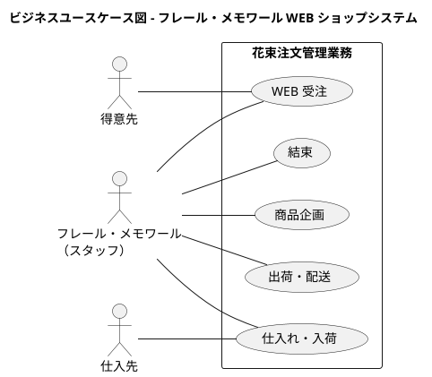

# ビジネスユースケース - フレール・メモワール WEB ショップシステム

## 概要

フレール・メモワール WEB ショップシステムにおけるビジネスユースケースを、要件定義の外部環境（層2）に基づいて整理する。

## アクター

| アクター | 説明 |
|---------|------|
| 得意先 | 花束を注文する顧客 |
| フレール・メモワール スタッフ | 受注・仕入・結束・出荷を担当する社内スタッフ |
| 仕入先 | 単品（花）を納品する取引先 |

## ビジネスユースケース図

## ビジネスユースケース一覧

### BUC01: 商品企画

**業務目標**: 得意先のニーズに応じた花束の商品ラインナップを企画・管理し、WEB ショップに掲載する商品を整備する。

**関連アクター**: フレール・メモワール スタッフ

**概要**: スタッフが花束の商品構成（単品の組合せ）を定義し、商品マスタとして登録・管理する。季節やイベントに合わせた商品ラインナップの維持を行う。

### BUC02: WEB 受注

**業務目標**: 得意先が WEB ショップから簡単に花束を注文でき、届け日・届け先・メッセージを指定して確実に受注を処理する。

**関連アクター**: 得意先、フレール・メモワール スタッフ

**概要**: 得意先が WEB ショップで商品を選択し、届け日・届け先・メッセージを指定して注文する。スタッフが受注内容を確認・管理する。1 受注 = 1 届け先 = 1 商品（花束）のルールに従う。

### BUC03: 仕入れ・入荷

**業務目標**: 受注に必要な単品（花）を適切なタイミングで仕入先から調達し、品質維持日数を考慮した在庫管理を実現する。

**関連アクター**: フレール・メモワール スタッフ、仕入先

**概要**: スタッフが在庫推移を確認し、発注判断を行う。単品ごとに特定の仕入先が決まっており、仕入先に発注して入荷を受け入れる。品質維持日数を考慮した廃棄ロスの最小化を目指す。

### BUC04: 結束

**業務目標**: 受注内容に基づき、出荷日に合わせて花束を結束（商品化）し、品質の高い商品を準備する。

**関連アクター**: フレール・メモワール スタッフ

**概要**: 出荷日（届け日の前日）に合わせて、受注された花束の結束作業を行う。必要な単品（花）を在庫から使用し、商品として仕上げる。

### BUC05: 出荷・配送

**業務目標**: 結束された花束を届け日に届け先へ確実に届けるために、出荷処理と配送手配を行う。

**関連アクター**: フレール・メモワール スタッフ

**概要**: 出荷日 = 届け日の前日のルールに従い、出荷予定の受注を確認して出荷処理を行う。配送手配を経て、届け日に届け先へ花束を届ける。
